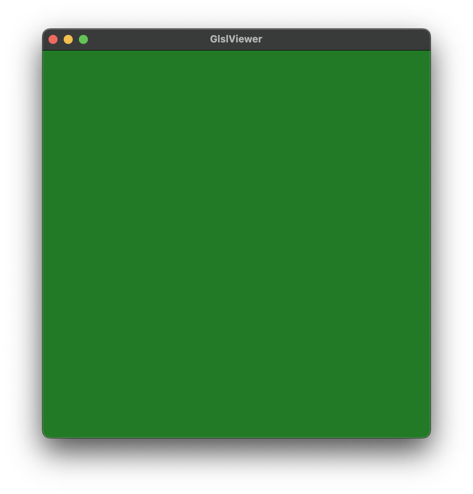
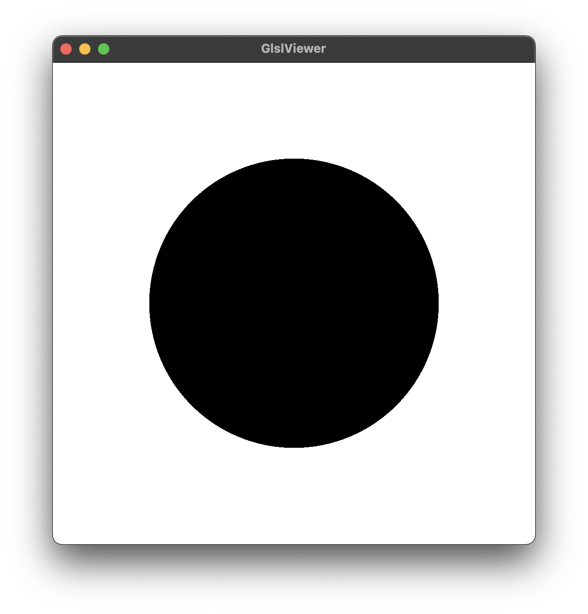

# Naseem's Shader Labs

Set of programs, experiments and research on shaders using GLSL and WebGL. I am very fascinated by this area of computer graphics and limitless creative possiblities and creation that can be built out of this.

# Experiment logs

| Exp no. |                                    Image/Video/Preview                                     | Name                | Description                                     | Location                      |
| :------ | :----------------------------------------------------------------------------------------: | :------------------ | :---------------------------------------------- | :---------------------------- |
| 001     | 

Show

 | 001-my-first-shader | My first shader!! displays a simple blank color | [Open ](/001-my-first-shader) |
| 002     |  

Show

   | 002-circle-shape    | Renders a circle shape                          | [Open ](/002-circle-shape)    |
